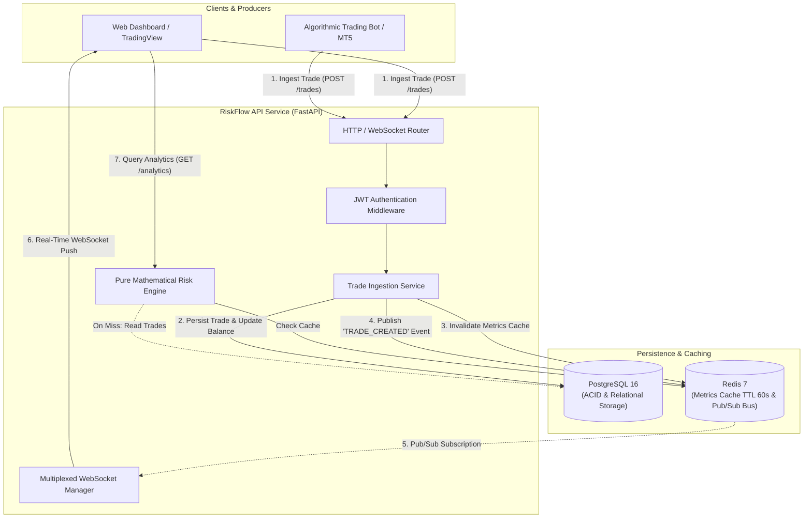

# RiskFlow API: Real-Time Trading Journal & Portfolio Risk Analytics Engine

[](https://fastapi.tiangolo.com)
[](https://www.python.org/)
[](https://www.postgresql.org/)
[](https://redis.io/)
[](https://www.sqlalchemy.org/)
[](https://www.docker.com/)
[](https://docs.pytest.org/)
[](https://github.com/astral-sh/ruff)
[](https://mypy-lang.org/)

**RiskFlow API** is an asynchronous, production-grade RESTful microservice and real-time streaming engine engineered for quantitative traders, prop firm accounts, and discretionary investment portfolios. It handles financial transaction ingestion, automated mathematical risk evaluation (Win Rate, Profit Factor, Peak-to-Trough Drawdown, Risk/Reward Ratio, and Mathematical Expectancy), high-speed Redis caching, and instantaneous event dispatching via WebSockets and Redis Pub/Sub.

---

## 🏛️ Architecture & System Design

RiskFlow follows strict **Clean Architecture (Hexagonal Architecture)** principles, ensuring total separation of concerns, high testability, and decoupling between domain logic, data access, and transport layers.

```
riskflow-api/
├── .github/workflows/ci.yml       # Automated CI/CD (Ruff, Mypy, Pytest >=80% Coverage)
├── docker/
│   ├── Dockerfile                 # Multi-stage build (Builder -> Minimal Runner)
│   └── entrypoint.sh              # DB Readiness probe, Alembic migrations, Auto-seed
├── docker-compose.yml             # Orchestration for FastAPI app, Postgres 16 & Redis 7
├── alembic/                       # Versioned database migrations
│   ├── versions/
│   └── env.py                     # Asynchronous migration runner
├── src/
│   ├── core/                      # Pydantic BaseSettings, Security (JWT/Bcrypt), DB & Redis
│   ├── domain/                    # Pure domain models (SQLAlchemy 2.0 Async), Enums, Exceptions
│   ├── schemas/                   # Pydantic v2 DTOs with strict input validation
│   ├── repositories/              # Repository pattern over SQLAlchemy AsyncSession
│   ├── services/                  # Business logic (Analytics engine, Trade lifecycle, WebSocket manager)
│   ├── api/                       # REST endpoints (v1) & WebSocket handlers
│   └── main.py                    # ASGI app, CORS, Process-Time middleware, Exception handlers
├── tests/                         # Pytest test suite (>80% coverage with async HTTPX)
├── scripts/
│   └── seed_data.py               # Deterministic demo dataset generator (50 realistic trades)
└── pyproject.toml                 # Tooling configuration (Ruff, Mypy, Pytest)
```

### System Architecture Flow



---

## 🧮 Quantitative Risk Engine & Mathematics

The mathematical engine in `src/services/analytics.py` executes without floating-point inaccuracies using Python's `Decimal` type:

1. **Win Rate (%):**
   $$\text{Win Rate} = \left(\frac{N_{\text{winning}}}{N_{\text{closed}}}\right) \times 100$$

2. **Profit Factor:**
   $$\text{Profit Factor} = \frac{\sum \text{Gross Profits}}{\sum |\text{Gross Losses}|}$$
   *(Returns `null` if no losses have occurred, indicating infinite profit factor).*

3. **Maximum Peak-to-Trough Drawdown (Monetary & Percentage):**
   For chronological equity trajectory $E_t = \text{Initial Balance} + \sum_{i=1}^t \text{PnL}_i$:
   $$\text{Peak}_t = \max_{1 \le k \le t}(E_k)$$
   $$\text{Drawdown}_t = \text{Peak}_t - E_t$$
   $$\text{Max Drawdown \%} = \max_t \left(\frac{\text{Drawdown}_t}{\text{Peak}_t} \times 100\right)$$

4. **Average Risk/Reward Ratio (RRR):**
   $$\text{RRR} = \frac{\text{Average Win}}{\text{Average Loss}}$$

5. **Mathematical Expectancy:**
   $$\text{Expectancy} = (\text{Win Rate} \times \text{Avg Win}) - (\text{Loss Rate} \times \text{Avg Loss}) = \frac{\text{Net Profit}}{N_{\text{closed}}}$$

---

## 🚀 Quick Start with Docker Compose

To boot the entire stack (API, PostgreSQL 16, Redis 7, automated migrations, and demo seed data) in a single command:

```bash
docker compose up -d --build
```

The containerized healthchecks will automatically ensure:
1. `db` (Postgres) and `redis` are healthy.
2. `alembic upgrade head` runs to apply all schema revisions.
3. `scripts/seed_data.py` populates a demo user, 2 accounts, and 50 realistic trades.
4. FastAPI starts on `http://localhost:8000`.

### Verifying the Setup

- **Swagger Interactive API Docs:** [http://localhost:8000/docs](http://localhost:8000/docs)
- **ReDoc Documentation:** [http://localhost:8000/redoc](http://localhost:8000/redoc)
- **Healthcheck:** [http://localhost:8000/health](http://localhost:8000/health)

---

## 🔑 Demo Credentials (Pre-seeded)

| Attribute | Value |
|---|---|
| **Email** | `demo@riskflow.io` |
| **Password** | `DemoPassword123!` |
| **Pre-configured Accounts** | 1. `FTMO Funded $100k` (PropFirm, USD)<br>2. `Interactive Brokers Swing Portfolio` (Personal, EUR) |

---

## 📡 API Endpoints & Payloads

### 1. Authentication (`/api/v1/auth`)

#### `POST /api/v1/auth/register`
```json
{
  "email": "trader@example.com",
  "password": "SecurePassword123!"
}
```
*Response (201 Created):*
```json
{
  "id": "e2a4a34b-4bbf-4c7c-9b7e-9626e2e505ec",
  "email": "trader@example.com",
  "created_at": "2026-10-03T16:00:00Z"
}
```

#### `POST /api/v1/auth/login`
```json
{
  "email": "demo@riskflow.io",
  "password": "DemoPassword123!"
}
```
*Response (200 OK):*
```json
{
  "access_token": "eyJhbGciOi...",
  "refresh_token": "eyJhbGciOi...",
  "token_type": "bearer",
  "expires_in": 1800
}
```

---

### 2. Trading Accounts (`/api/v1/accounts`)

#### `POST /api/v1/accounts/`
*Headers: `Authorization: Bearer <token>`*
```json
{
  "name": "Evaluation Step 1",
  "broker_type": "PropFirm",
  "initial_balance": "100000.00",
  "currency": "USD"
}
```

---

### 3. Trade Ingestion (`/api/v1/trades`)

#### `POST /api/v1/trades/`
*Ingests a trade, updates account equity, invalidates Redis analytics cache, and broadcasts to WebSockets.*
```json
{
  "account_id": "4161bb7a-364e-4f3d-9d41-a164985ca88b",
  "symbol": "XAUUSD",
  "direction": "BUY",
  "entry_price": "2350.50",
  "lot_size": "2.0",
  "status": "OPEN"
}
```

#### `POST /api/v1/trades/{trade_id}/close`
```json
{
  "exit_price": "2365.00",
  "pnl": "2900.00"
}
```

---

### 4. Portfolio Analytics (`/api/v1/analytics`)

#### `GET /api/v1/analytics/accounts/{account_id}`
*Retrieves calculated risk metrics with 60s Redis caching.*
```json
{
  "account_id": "4161bb7a-364e-4f3d-9d41-a164985ca88b",
  "total_trades": 50,
  "closed_trades": 45,
  "open_trades": 5,
  "winning_trades": 26,
  "losing_trades": 19,
  "break_even_trades": 0,
  "win_rate_pct": "57.78",
  "loss_rate_pct": "42.22",
  "gross_profit": "28450.00",
  "gross_loss": "12100.00",
  "net_profit": "16350.00",
  "profit_factor": "2.3512",
  "max_drawdown_amount": "3450.00",
  "max_drawdown_pct": "3.18",
  "average_win": "1094.23",
  "average_loss": "636.84",
  "risk_reward_ratio": "1.7182",
  "expectancy": "363.33",
  "cached": true,
  "calculated_at": "2026-10-03T16:05:00Z"
}
```

---

### 5. Real-Time WebSockets (`/api/v1/ws`)

Connect to:
```
ws://localhost:8000/api/v1/ws/accounts/{account_id}?token=<jwt_access_token>
```

Upon connection:
```json
{
  "event_type": "CONNECTED",
  "account_id": "4161bb7a-364e-4f3d-9d41-a164985ca88b",
  "message": "Successfully subscribed to real-time events for account 4161bb7a-364e-4f3d-9d41-a164985ca88b"
}
```

When a new trade is created or closed, connected clients immediately receive:
```json
{
  "event_type": "TRADE_CREATED",
  "account_id": "4161bb7a-364e-4f3d-9d41-a164985ca88b",
  "trade": {
    "id": "c1f7b76a-3958-4770-b747-d1cb89b6f52e",
    "account_id": "4161bb7a-364e-4f3d-9d41-a164985ca88b",
    "symbol": "US100",
    "direction": "BUY",
    "entry_price": "19250.00",
    "exit_price": null,
    "lot_size": "1.0",
    "pnl": null,
    "opened_at": "2026-10-03T16:08:12Z",
    "closed_at": null,
    "status": "OPEN"
  },
  "timestamp": "2026-10-03T16:08:12Z"
}
```

---

## 🧪 Local Testing & Quality Assurance

### 1. Set Up Local Python Environment

```bash
python -m venv .venv
source .venv/bin/activate  # On Windows: .venv\Scripts\activate
pip install -r requirements-dev.txt
```

### 2. Code Linting & Formatting Check (Ruff)

```bash
ruff check .
ruff format --check .
```

### 3. Static Type Checking (Mypy Strict)

```bash
mypy
```

### 4. Running the Test Suite (>=80% Coverage)

```bash
pytest -v --cov=src --cov-report=term-missing --cov-fail-under=80
```

---

## 🔄 CI/CD Pipeline (GitHub Actions)

A fully automated CI pipeline is configured at `.github/workflows/ci.yml`. On every push and pull request to `main` and `develop`:
1. Spawns ephemeral **PostgreSQL 16** and **Redis 7** service containers.
2. Checks code style and imports with **Ruff**.
3. Enforces static typing with **Mypy**.
4. Runs integration and unit tests with **Pytest**.
5. Fails the build if test coverage drops below **80%**.
6. Archives and uploads coverage reports.

---

## 📄 License
This project is open-source and distributed under the MIT License.
